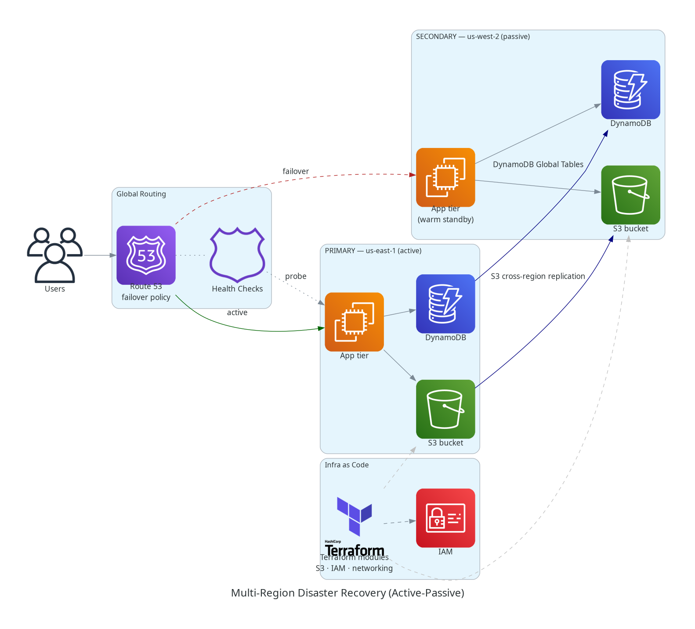
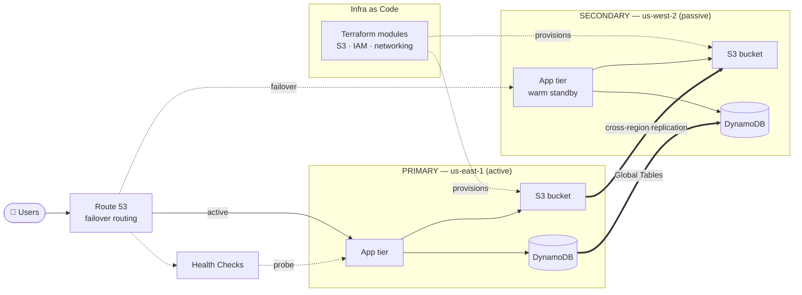

# Multi-Region Disaster Recovery Solution — Architecture

> Active-passive disaster recovery across two AWS regions. **RPO 5 min · RTO 15 min.**
> Repo: [github.com/bukx/multi-region-dr](https://github.com/bukx/multi-region-dr)



## Mermaid view



## Components & data flow

| Concern | Service | Responsibility |
|---------|---------|----------------|
| Routing | **Route 53** | Failover routing policy directs traffic to primary; reroutes to secondary on health-check failure. |
| Detection | **Route 53 health checks** | Probe the primary endpoint; trigger automated DNS failover. |
| Data — DB | **DynamoDB Global Tables** | Active-active table replication keeps the passive region within the 5-min RPO. |
| Data — objects | **S3 Cross-Region Replication** | Asynchronously replicates objects to the secondary bucket. |
| Provisioning | **Terraform modules** | Reusable modules build S3, IAM, and networking identically in both regions. |

## DR targets

| Metric | Target | How it's met |
|--------|--------|--------------|
| **RPO** | 5 minutes | Continuous Global Tables + S3 CRR keep data loss window small. |
| **RTO** | 15 minutes | Route 53 health-check failover + warm standby tier in the secondary region. |

## Design notes
- **Active-passive:** secondary runs as a warm standby — data replicates continuously, compute scales up on promotion.
- **Automated failover:** no manual DNS edits; health checks flip the record set.
- **Repeatable regions:** Terraform modules guarantee the passive region matches the active one.

## Render the PNG
```bash
python architecture.py   # requires: pip install diagrams  +  graphviz binary
```
